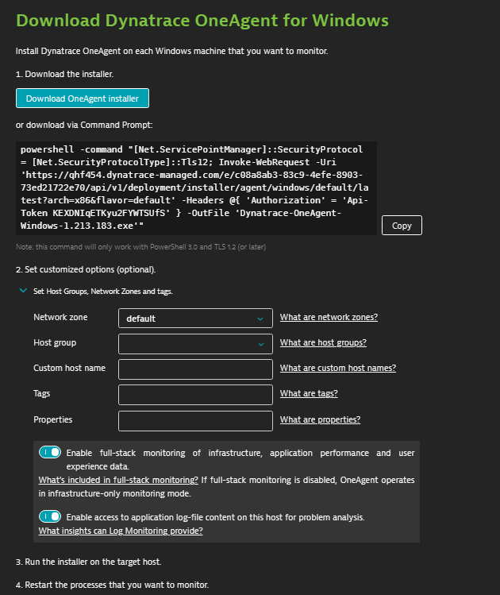

summary: Training Lab Activities 101
id: dynatrace-basics-activities-101
categories: Training
tags: dynatrace-india, trainings
status: Draft 
authors: Vishruth Harithsa
Feedback Link: https://thetechnologist.in
Analytics Account: G-59D7VS39H4


# Dynatrace Basics - Lab Activities 101
<!-- ------------------------ -->
## Getting Started
Duration: 2


Hello, 👋 Welcome to Dynatrace training. We know it has been a long journey for you to get to here. It is all like, getting education atleast for 15 years and jumping into job and finding your ways to stick to one domain. We appreciate the effort and we respect you immensely. Thank you for taking this training. From Dynatrace India, we wish yuo all the best and keep learning. We are here to help you anytime. If you have questions or if you need any help, please raise an issue in our public GitHub repository. We will addres it for you as soon as we can. 

### User repository
1. Here is the link for the repository: [https://github.com/Dynatrace-India/Dynatrace-Training/issues](https://github.com/Dynatrace-India/Dynatrace-Training/issues)
1. Checkout Dynatrace Official Help: [https://www.dynatrace.com/support/help/](https://www.dynatrace.com/support/help/)

Negative
: Note that please use this repository only if you are really passionate to learn about Dynatrace. This is an initiative from Dynatrace India ACE team to help people who are curious. 

### What's in here
- List of training activities with instructions
- Explaination about the terms that are new
- Some documentation links to help you learn more
- Closing charts

<!-- ------------------------ -->
## What you'll learn 
Duration: 1

### List of activities
- Setting Up Lab Environment
- Install Dynatrace OneAgent
- What happens during the installation of OneAgent?
- Smartscape
- Installing ActiveGate
- Activity: Practice

<!-- ------------------------ -->
## Activity: Setting-up lab environment
Duration: 10

In this training lab, we have provided you with 2 VMs which will be used for lab activities. Hence, before starting the training please get to know your credentials and that are sent to you to your email personally along with RDP files to connect to VMs.

### Lab Activity
1. Sign in to your mail box and find an email with RDP files and password to access them.
1. Once login is complete, use another email that you have received from **notifications-dynatrace** and login to dedicated Dynatrace environment for training.
1. If you want to access anytime after setting password to your DT Environment, please use this link [https://bit.ly/dt-transform](https://bit.ly/dt-transform)
1. Raise your hand if you are able to set up environment and access virtual machines.
1. Using this link, [EasyTravel](https://community.dynatrace.com/community/display/DL/Demo+Applications+-+easyTravel#DemoApplications-easyTravel-Download(Installer+License)) please download Windows version of the application (x64) and install it in both your VMs.
1. Start easyTravel via the UI, clicking on Dynatrace Production Standard.
1. This will ensure that the application is running. you can make sure by visiting the site the is shown in the window of EasyTravel.
1. Congratulations! Now you are ready to implement and move forward with the training. 

<!-- ------------------------ -->
## Activity: Installing Dynatrace OneAgent
Duration: 15

### Accessing Dynatrace Environment
- Access your environment by going to this link, [https://bit.ly/dt-transform](https://bit.ly/dt-transform)
- Login with your credentials
- Go to Dynatrace Hub

### Installing OneAgent
- In Dynatrace Hub, search for OneAgent and click on the card to access OneAgent details page
- Click on Download OneAgent button and it will take you to the screen where you have to choose the OS.
- Go ahead and select Windows.
- Download the installer. There are two options:
	- Click the Download Installer button to download the Windows installer (EXE file) for single-server installation.
	- The OneAgent Windows EXE installer is preconfigured for your environment. If you need to customize it, you can add add the installation parameters at a Windows command line. You can also add the ```--set-param=<value>``` parameters on the Configure OneAgent settings installer screen.
	- For more information, see Customize OneAgent installation on Windows



- Run the executable file and follow the displayed instructions. If your environment is segmented, for example into development and production, consider organizing your hosts into host groups. To do this, select the Set host group for this host option and provide a name. If the name you enter exists already, the host will be added to the group with this name. If you provide a new name, a new host group will be created. The EXE installer provides a quiet mode. Simply use it with command-line ```--quiet``` parameter.
- Restart all processes that you want to monitor. You’ll be prompted with a list of the processes that need to be restarted. Note that you can restart your processes at any time, even during your organization’s next planned maintenance period. Though until all processes have been restarted, you’ll only see a limited set of metrics, for example CPU or memory consumption.

### Next steps
- Access the Deployment Status screen.
- Stop and restart easyTravel UI.

<!-- ------------------------ -->
## What happens during the installation of OneAgent?
Duration: 3
OneAgent is a set of specialized services that have been configured specifically for your monitoring environment. The role of these services is to monitor various aspects of your hosts, including hardware, operating system, and application processes.

During the installation process, the installer
- Installs executable code and libraries that are used by OneAgent.
- Creates entries in the Windows Registry that start OneAgent as a SYSTEM service. Additionally, the oneagentmon device and WinPcap are installed to allow better integration with the operating system and to facilitate the capture of network statistics.
- Checks the system’s global proxy settings.
- Checks for a connection to Dynatrace Server or ActiveGate (if you installed ActiveGate and downloaded the OneAgent installer after ActiveGate was connected to Dynatrace).
- ```OneAgent 1.193 and earlier``` Creates its own user (dtuser) to run OneAgent extensions. This user is a member of the Performance Monitoring Users group, and can only log in as a service. The password is randomly generated during installation and stored encrypted. You can't change the password. For security purposes, the dtuser is not allowed to:
	- Access computer from the network.
	- Log in as a batch job.
	- Log in locally.
	- Log in through Remote Desktop Services.
	- The dtuser is required for Dynatrace to operate properly, therefore you must not delete it. If, for some reason, the dtuser was deleted, next update will recreate it.
- ```OneAgent 1.195+``` For fresh OneAgent 1.195+ installations, the default ```LocalSystem account``` is used to run OneAgent extensions. For a summarized view of the changes made to your system by OneAgent installation, see [OneAgent security on Windows](https://www.dynatrace.com/support/help/technology-support/operating-systems/windows/installation/oneagent-security-windows/).

Positive
: For more details on the installation, please go through this link from Dynatrace help on [Install OneAgent on Windows](https://www.dynatrace.com/support/help/technology-support/operating-systems/windows/installation/install-oneagent-on-windows/#expand-what-happens-during-installation-3846)


<!-- ------------------------ -->
## Activity: Smartscape
Duration: 10


- Select a host. Observe the processes associated with the host selected. 
- Select the Apache Tomcat process. Note how many services are attached.
- Click a service. Note the difference in the Smartscape.
- Click the arrow. The Services Overview page displays. 
- Click Smartscape view. 

Positive
: For more instructions on Smartscape, please go through Dynatrace help on [Smartscape](https://www.dynatrace.com/support/help/how-to-use-dynatrace/smartscape/).

<!-- ------------------------ -->
## Activity: Installing ActiveGate
Duration: 10

- Navigate to Dynatrace Hub > ActiveGate > Install ActiveGate > Windows
- Download the Installer - Windows.
- Run the installer on the host(s) where the ActiveGate(s) will run.
- ActiveGate Runs within your data center
	- For Agent traffic bundling
	- For remote plugin execution
	- Storing memory dumps
- Already connected Agents automatically reroute through AG when found.

Positive
: For more details on Installation of ActiveGate, visit this link [Install an Environment ActiveGate on Windows](https://www.dynatrace.com/support/help/setup-and-configuration/dynatrace-activegate/installation/windows/windows-install-an-environment-activegate/)

<!-- ------------------------ -->
## Activity: Practice
Duration: 10

- Navigate to the Home Dashboard
- Access the tiles available, and record what you are able to view. 
- Filter the dashboard based on the last 1 hour. Notice how the dashboard data changes. 
- Access the Smartscape from the Dashboard, locate easyTravel and note the services, processes, hosts, and data centers connected. 
- Access an Apache Tomcat host via the home dashboard. Note the CPU usage. 
